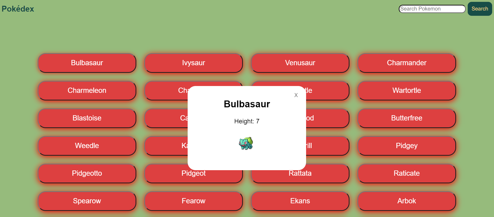

# JavaScript App (Pokédex)

  
  

## About The Project

Objective:
- Build a basic app with vanilla JavaScript that gets some data, displays it in a responsive layout, and uses advanced UI patterns to display more details of individual items

## Features and Requirements

User Story:
- As a user, I want to view a list of Pokémon and see more details for a given data item on demand

Key Features:
- Load data from an external source (PokéAPI).
- View a list of items.
- On user action, view details for that item.

## How to get the project running:
- Click on each pokemon to retrieve a modal which displays the details of each pokemon and an image.
Search bar which can help filter/search pokemon via their name.

## Project description

TECHNOLOGIES USED

- [PokéAPI](https://github.com/PokeAPI/pokeapi)
- [jQuery](https://jquery.com/)
- [Bootstrap](https://getbootstrap.com/)

## Project dependencies:

- The app is built using ECMAScript2015(ES6)

## API used by the project:

- PokeApi url: https://pokeapi.co/

## Live link:

project link : https://github.com/HalehGhavami/simple-js-app
