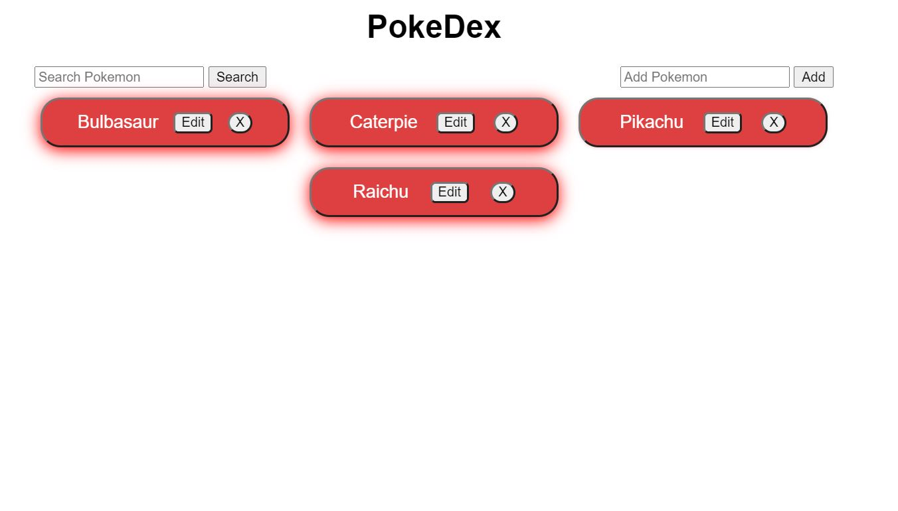
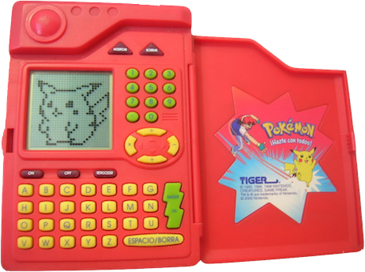

# PROJECT DESCRIPTION:

 Whitin this project I build a web application whit HTML, CSS and JS that load from an external API 

## Atom HTML Preview:

  
  

## API USED BY THE PROJECT:
PokeApi url: https://pokeapi.co/

  
  

